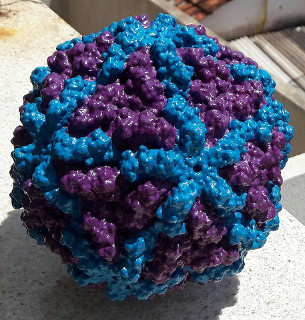

# pdb2stl

## Conversion of Protein Data Bank (PDB) structures for 3D printing.

pdb2stl is a collection of programs to calculate a representation of molecular surface in the STL file format, given a molecular description in the PDB file format, to be used in 3D printing software.
If it is described in PDB, it can be printed!


 

Basic pipeline is as follows:

**PDB** (input)

**EDTSurf** (calculation of Connolly molecular surface)

**libigl** + **Eigen** (reduction of number of points, optional)

**off2stl** (format conversion)

**STL** (output)


## Requirements:

* C and C++ compilers

* [libigl](https://github.com/libigl/libigl)

* [Eigen](http://eigen.tuxfamily.org)

* [EDTSurf](https://zhanglab.ccmb.med.umich.edu/EDTSurf)


## Installation

The following directories are expected for installing the programs and will be created:
```
pdb2stl/
pdb2stl/libigl
pdb2stl/eigen
pdb2stl/edtsurf
```

Commands below will create the directories and download pdb2stl and its requirements:


```
git clone https://github.com/samuelrsilva/pdb2stl
cd pdb2stl
git clone --recursive https://github.com/libigl/libigl.git
git clone https://github.com/eigenteam/eigen-git-mirror.git
mv eigen-git-mirror eigen
mkdir edtsurf
wget https://zhanglab.ccmb.med.umich.edu/EDTSurf/EDTSurf.zip
unzip EDTSurf.zip -d edtsurf
patch -p0 < edtsurf.patch
```

Review Makefile

```
make
make install DESTDIR=/your/directory
```

`/your/directory` should be in your `$PATH`.
If omitted, `DESTDIR` defaults to `/usr/local/bin`.


## Usage

```
pdb2stl input.pdb [ percentage of faces to keep ]
```

`percentage of faces to keep` is an optional argument.

## License

decimate.cc is released under [MPL2](http://www.mozilla.org/MPL/2.0/).

pdb2stl and off2stl.c are under [GPLv3](https://www.gnu.org/licenses/gpl-3.0.en.html) ([FAQ](https://www.gnu.org/licenses/gpl-faq.html#MereAggregation)).


## Please cite

If you use pdb2stl, please acknowledge the appropriate references from libigl, Eigen and EDTSurf, especially:

```
@misc{libigl,
	title = {{libigl}: A simple {C++} geometry processing library},
	author = {Alec Jacobson and Daniele Panozzo and others},
	note = {http://libigl.github.io/libigl/},
	year = {2017}
}
```

and

```
@article{Xu2009,
	author = {Dong Xu and Yang Zhang},
	title = {Generating triangulated macromolecular surfaces by Euclidean Distance Transform},
	journal = {PLoS ONE},
	volume = {4},
	number = {12},
	year = {2009},
	month = {dec.},
	address = {San Francisco}
}
```

Thanks to [Laure Stelmastchuk](https://www.3dhubs.com/s%C3%A3o-carlos/hubs/laure-stelmastchuk) for suggesting the idea for this program.
